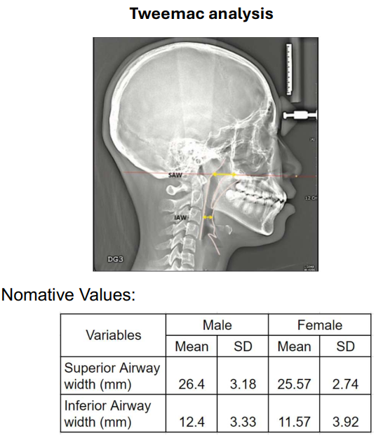
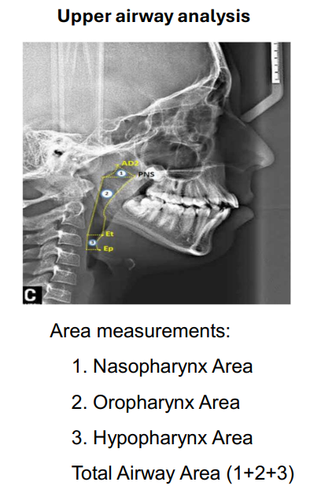
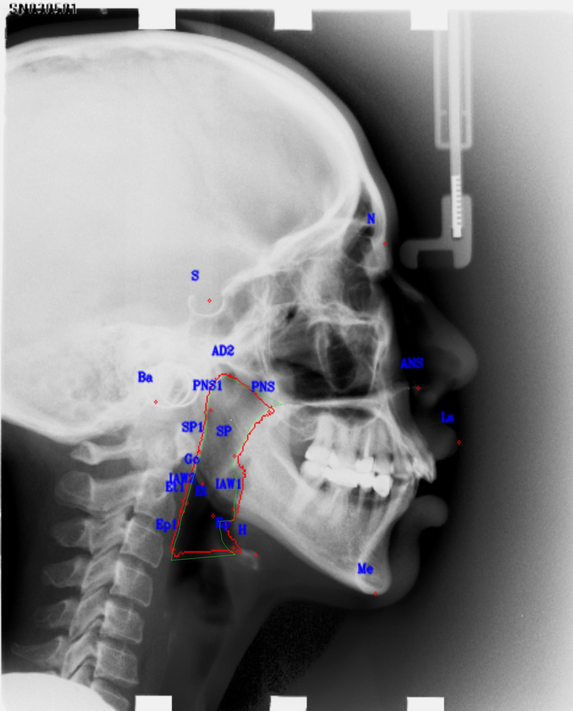
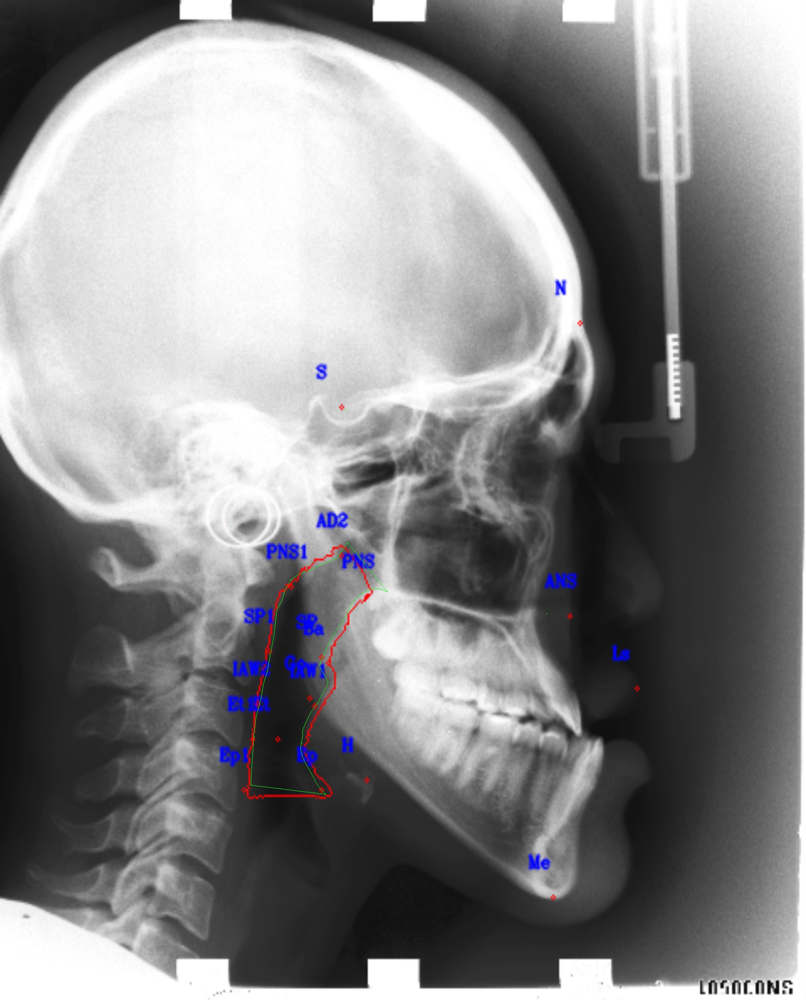
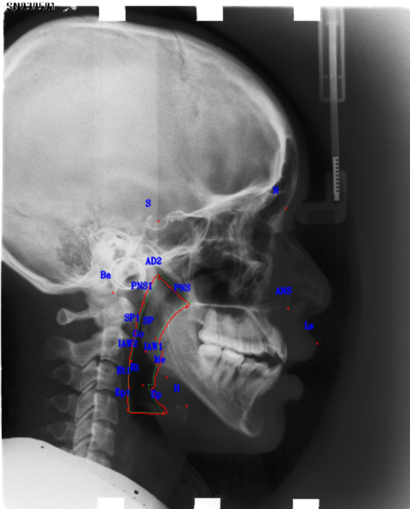
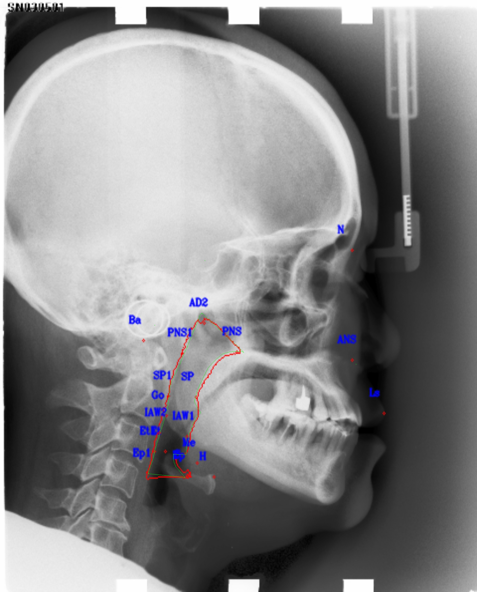

# Upper Airway Evaluation on cephalometric image by deep learning approach
### (By Vietnamese Orthodontic Research Group - VORG)
# Introduction

In this study, we developed a fully automated deep learning model called HydraNetwork for evaluating 
Upper Airway on cephalometric image.

# Method
In this study, we proposed to use two analysis to evaluate Airway on cephalometric including:
- Tweemac analysis
- Upper Airway analysis
<div style="display: flex; justify-content: space-between;">
    
    
</div>

# Dataset
In this study, we used our private data set for developing the model.
The dataset includes 586 images was separated in to train set and test set with ratio 70:30
We annotated 19 landmark points and mask of Upper Airway area on cephalometric images. 
For inference, we used public dataset IBSI 2015 challenges which include 400 images.

### Data annotation 

In this project, we use CVAT for annotating landmarks and mask on cephalometric images.
List of landmarks, refer to `./data/points_labels.py`
The annotation from CVAT must be export in "CVAT for image 1.1
Structure of input image folder and its annotation in xml file as below :
```
├──v1.0
│    ├── original
│    │   ├── images
│    │   │   ├── 001.jpeg
│    │   │   ├── 002.jpeg
│    │   │   ├── ...
│    │   ├── masks
│    │   │   ├── 001.jpeg
│    │   │   ├── 002.jpeg
│    │   │   ├── ...   
│    ├── train
│    │   ├── images
│    │   │   ├── 001.jpeg
│    │   │   ├── 002.jpeg
│    │   │   ├── ...
│    │   ├── masks
│    │   │   ├── 001.jpeg
│    │   │   ├── 002.jpeg
│    │   │   ├── ...
│    │   │   
│    ├── test
│    │   ├── images
│    │   │   ├── 280.jpeg
│    │   │   ├── 281.jpeg
│    │   │   ├── ...
│    │   ├── masks
│    │   │   ├── 280.jpeg
│    │   │   ├── 281.jpeg
│    │   │   ├── ...   
│    ├── annotations.xml
```

# Environment setup
* Pytorch >=1.11
* CUDA Version: >=11.3
* CUDNN version: >=8 
* OS: Ubuntu >=20.04
* Python3 version: >=3.8.10

#### Install dependencies

```commandline
pip install ./requirements.txt
```
# Training, evaluation and inference

### 1. Configuration file
Modify file `./configs/configuration`

```
    data_version = 'v1.0'                    #### Keep unchage 
    root_data_dir = '/data/Airway/v1.0/'     #### set dir path as above structure of input image folder
    root_experiment_name = '_final           #### Name of experiment
    visualization = False
    visualize_output_on_training = False
    transform = False
    multi_gpus = False
    n_gpu = 2
    gpu_id = 0
    resume = False
    base_number = 40
    resize_h = 512
    resize_w = 480
    sigma = 10
    loss_weight = [0.8,0.8, 10.0] ####### [landmark_loss, landmark_loss_refine, segment_loss]
    num_epochs = 60
    lr = 1e-3
    lr_step_milestones = [20,40]
    # lr_step_milestones = [0,1,2]
    debug_steps = 10
    validation_step = 5
    batch_size = 1
    save_weight_every_epoch = 10
```
### 2. Pre-processing data
1. First and foremost, we need to create mask images from original images.
Modify "DATA_DIR" and "annotationFile" in ```0.1.Generate_mask.py```
```commandline
python3 0.1.Generate_mask.py
```
It will create mask image then save to "masks" folder.
2. Separate original data into train set and test set (include images data and mask data)
```commandline
python3 0.2.Separate_data.py
```

### 3. Training

```commandline
python3 1.Train_AirwayEvaluation.py
```
### 4. Evaluation
```commandline
python3 2.Eval_AirwayEvaluation.py
```
### 5. Run inference 
```commandline
python3 3.Inference_AirwayEvaluation.py
```

# Results

#### Evaluation result

1. The table in below is evaluation results of landmark detection head:

```markdown
| Point names | <=20       | <=25       | <=30       | <=40       | mean_err    |
|-------------|------------|------------|------------|------------|-------------|
| Ba          | 0.823864   | 0.875      | 0.897727   | 0.926136   | 25.10573422 |
| S           | 0.914773   | 0.914773   | 0.914773   | 0.926136   | 46.20167335 |
| PNS         | 0.857955   | 0.897727   | 0.920455   | 0.977273   | 12.49663164 |
| ANS         | 0.892045   | 0.926136   | 0.943182   | 0.960227   | 21.98628292 |
| AD2         | 0.869318   | 0.920455   | 0.954545   | 0.954545   | 17.23556744 |
| Ep          | 0.8125     | 0.869318   | 0.892045   | 0.931818   | 16.32071919 |
| Et          | 0.892045   | 0.914773   | 0.926136   | 0.960227   | 11.58094122 |
| PNS1        | 0.727273   | 0.795455   | 0.823864   | 0.897727   | 23.02965918 |
| Et1         | 0.875      | 0.909091   | 0.926136   | 0.954545   | 10.6851241  |
| Ep1         | 0.823864   | 0.897727   | 0.926136   | 0.960227   | 15.30995489 |
| IAW1        | 0.943182   | 0.965909   | 0.971591   | 0.988636   | 10.11249784 |
| IAW2        | 0.880682   | 0.914773   | 0.9375     | 0.982955   | 12.13804104 |
| H           | 0.914773   | 0.920455   | 0.943182   | 0.948864   | 11.62230214 |
| SP          | 0.778409   | 0.829545   | 0.863636   | 0.897727   | 19.8549361  |
| SP1         | 0.704545   | 0.818182   | 0.846591   | 0.886364   | 27.80020172 |
| Go          | 0.710227   | 0.8125     | 0.857955   | 0.920455   | 19.0191685  |
| Me          | 0.977273   | 0.982955   | 0.982955   | 0.982955   | 9.229208413 |
| N           | 0.835227   | 0.863636   | 0.863636   | 0.886364   | 30.69842783 |
| Ls          | 0.943182   | 0.971591   | 0.971591   | 0.977273   | 21.92504208 |
| Average     | 0.851376   | 0.894737   | 0.913876   | 0.943182   |             |

```

2. The table in below is evaluation result of segmentation head:

| Metric            | Value       |
|-------------------|-------------|
| Mean pixel acc    | 0.997603188 |
| Mean Dice         | 0.92803302  |
| Mean Precision    | 0.951237673 |
| Mean specificity  | 0.999085979 |
| Mean recall       | 0.915468837 |

#### There some output results of the proposal method in below:
- Green landmark: Ground truth
- Red landmark: Prediction

<div style="display: flex; justify-content: space-between;">
    
    
    
    
</div>

# Reference

This implementation based on some below repos:
https://github.com/mkisantal/backboned-unet/blob/master/backboned_unet/unet.py
https://github.com/usuyama/pytorch-unet
https://github.com/mberkay0/pretrained-backbones-unet
# Author
- Thanh Nguyen Huy (nhthanh0809@gmail.com, thanhhn@medbrainlab.com, https://github.com/nhthanh0809)
